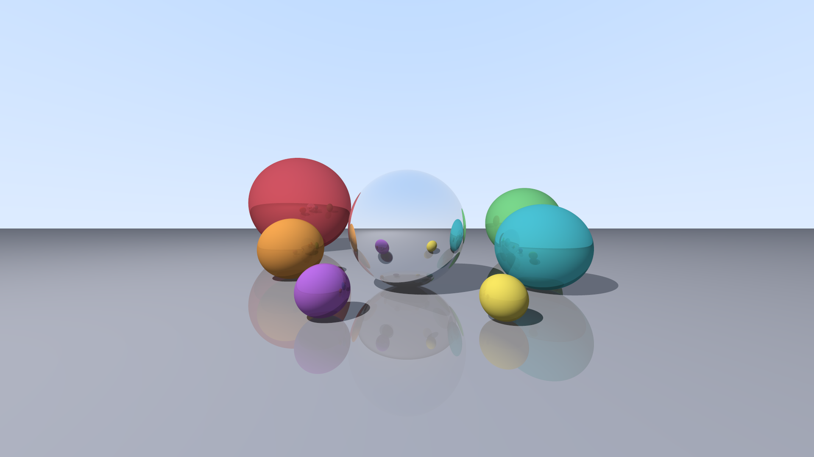

# Ray tracer en Rust

Un moteur de rendu par lancer de rayons (*ray tracing*) sur CPU, écrit en Rust, sans bibliothèque graphique externe. Seule la crate `rayon` est utilisée pour le parallélisme.


Scène `vitrine` en 1920x1080 : 8 objets, réflexions, anti-aliasing 4x4.

## Sommaire

- [Ce que fait le programme](#ce-que-fait-le-programme)
- [Les maths en jeu](#les-maths-en-jeu)
- [Lancer le programme](#lancer-le-programme)
- [Architecture](#architecture)
- [Choix de conception](#choix-de-conception)
- [Mesures de performances](#mesures-de-performances)
- [Profilage](#profilage)
- [Limites et pistes](#limites-et-pistes)
- [Licence](#licence)

## Ce que fait le programme

- Formes : sphères, plans infinis.
- Éclairage : une source ponctuelle, modèle diffus de Lambert et lumière ambiante.
- Ombres portées : ombres dures via un rayon d'ombre vers la lumière.
- Réflexions récursives : coefficient de 0 (mat) à 1 (miroir), reflet teinté par la couleur de l'objet, profondeur maximale de 5 rebonds.
- Anti-aliasing : suréchantillonnage 4x4.
- Couleur & sortie : correction gamma (γ = 2), écriture directe au format binaire PPM (P6).
- Parallélisme : distribution des calculs de pixels avec `rayon`.

## Les maths en jeu

Un rayon part de l'origine O dans la direction unitaire d :

```math
P(t) = O + t\,\vec{d}, \qquad t > 0
```

Intersection avec une sphère de centre C et de rayon R (avec oc = O − C) : une équation du second degré en t, dont on garde la plus petite racine positive.

```math
t^2 + 2\,(\vec{d} \cdot \vec{oc})\,t + \lVert \vec{oc} \rVert^2 - R^2 = 0
```

Éclairage diffus de Lambert, avec n la normale et l la direction vers la lumière :

```math
E = a + (1 - a)\,\max(0,\ \vec{n} \cdot \vec{l}), \qquad a = 0{,}1 \text{ (ambiante)}
```

Direction d'un rayon réfléchi :

```math
\vec{r} = \vec{d} - 2\,(\vec{d} \cdot \vec{n})\,\vec{n}
```

## Lancer le programme

### Prérequis

- Rust (testé avec Rust 1.98.1, `edition = "2024"`).

### Exécution

Le binaire génère directement le fichier `image.ppm` à la racine :

```bash
cargo run --release
```

Pour visualiser ou convertir l'image générée :

```bash
ffmpeg -i image.ppm docs/rendu.png
```

## Architecture

| Module | Rôle |
|---|---|
| `vec3` | Vecteur 3D, opérateurs (`+`, `-`, `*`, `neg`, `+=`), `dot`, `normalized`, `reflechi`, `Sum` |
| `ray` | Rayon : origine, direction, point à la distance t |
| `forme` | `enum Forme { Sphere, Plan }` : équation d'intersection et normale |
| `objet` | `Objet { forme, couleur, reflexion }`, recherche de l'obstacle le plus proche (`plus_proche`) |
| `couleur` | Alias `Couleur = Vec3`, constantes, conversion en octets `[u8; 3]` avec gamma |
| `lumiere` | Source de lumière ponctuelle : `Lumiere { position }` |
| `scene` | `Scene { objets, lumiere }`, scènes prédéfinies `demo` et `vitrine` |
| `rendu` | Caméra, couleur du ciel, calcul d'éclairage récursif, ombres, anti-aliasing |
| `main` | Dimensions, lancement du rendu, écriture du fichier PPM |

## Choix de conception

- `enum` plutôt que `Box<dyn Trait>` pour les formes : environ 5 fois plus rapide. L'absence d'appel indirect (pas de vtable), une disposition mémoire contiguë et l'inlining par le compilateur expliquent cet écart.
- Matériau dans `Objet`, pas dans chaque `Forme` : séparer la géométrie de l'aspect visuel a permis d'ajouter la réflexion en une seule ligne dans `Objet`, sans toucher aux calculs d'intersection.
- Calculs en `f64` : la conversion en octets `u8` se fait uniquement à l'écriture finale du fichier, évitant les pertes de précision pendant les rebonds.
- Rendu séparé de l'écriture : le moteur remplit un Vec<Couleur> en mémoire avant d'écrire le fichier sur le disque. C'est nécessaire pour pouvoir utiliser `into_par_iter()` de la crate `rayon`, qui permet de paralléliser le calcul.
- Grille régulière plutôt qu'aléatoire pour l'anti-aliasing.

## Mesures de performances

Image de 400 x 225, mode release, médiane de 3 lancements, sur une machine à 2 vCPU (Debian 13, Rust 1.98.1) :

| Étape | Calcul | Écriture | Remarques |
|---|---|---|---|
| 1. Sphères unies | 4,0 ms | 14,0 ms (P3) | L'écriture texte (PPM ASCII). |
| 2. Éclairage | 4,5 ms | ~14 ms | Coût minime du produit scalaire de Lambert. |
| 3. Ombres portées | 6,0 ms | ~14 ms | +32 % seulement : `any()` s'arrête dès le 1er obstacle rencontré, et le ciel ne lance aucun rayon d'ombre. |
| 4. Réflexions | ~9 ms | ~11-15 ms | Passer d'une profondeur max de 1 à 50 ne change presque rien : peu d'objets se reflètent mutuellement. |
| 5. Anti-aliasing 4x4 | ~172 ms | ~15 ms | x16 rayons : le calcul devient plus gourmand. |
| 6a. PPM binaire (P6) | ~172 ms | ~1,4 ms | Écriture 10 fois plus rapide, fichier de 270 015 octets (400 x 225 x 3 + en-tête). |
| 6b. Parallélisme (`rayon`) | ~75 ms | ~1,8 ms | Calcul environ 2 fois plus rapide (x2,3 mesuré). |

> Scène `vitrine` en 1920 x 1080 (8 objets, 16 rayons par pixel, réflexions, 2 coeurs) : environ 3,4 s de calcul.

## Profilage

Temps propre de chaque fonction, mesuré avec `perf` et un flamegraph (après inlining) :

| Fonction | Temps | Contenu inliné |
|---|---|---|
| `couleur_rayon` | 36 % | ombres, éclairage, réflexion |
| `plus_proche` | 32 % | tests d'intersection rayon/objet |
| closure de `rendu` | 25 % | caméra, suréchantillonnage, 1ᵉʳ niveau de `couleur_rayon` |
| noyau | ~2 % | allocations et mémoire |

En cumulé :
- `intersecte` : 29 % du temps total
- `dans_l_ombre` : 27 % (note : appelle lui-même `intersecte`)
- `sqrt` : 8,5 %

## Limites et pistes

### Limites actuelles

- Caméra fixe avec un angle de vue large, ce qui provoque une déformation sur les bords.
- Une seule source de lumière ponctuelle, produisant des ombres dures (sans pénombre).
- Pas de réfraction (verre), pas de textures, pas de maillages triangulaires.
- Anti-aliasing uniforme : 16 rayons sont tirés partout, y compris sur les zones plates (ciel, sol uni).

### Prochaines étapes

- [ ] Anti-aliasing adaptatif : ne tirer 16 rayons que sur les contrastes/bords et 1 seul sur les zones unies.
- [ ] Caméra avec plus de paramètre : position, cible regardée, champ de vision.
- [ ] Matériaux et textures : réfraction (loi de Snell-Descartes), damier procédural, triangles.
- [ ] Structure accélératrice (BVH) : arbre de boîtes englobantes pour gérer des milliers d'objets sans tester chaque rayon contre chaque primitive.

## Licence

Distribué sous licence MIT. Voir le fichier `LICENSE` pour plus de détails.
